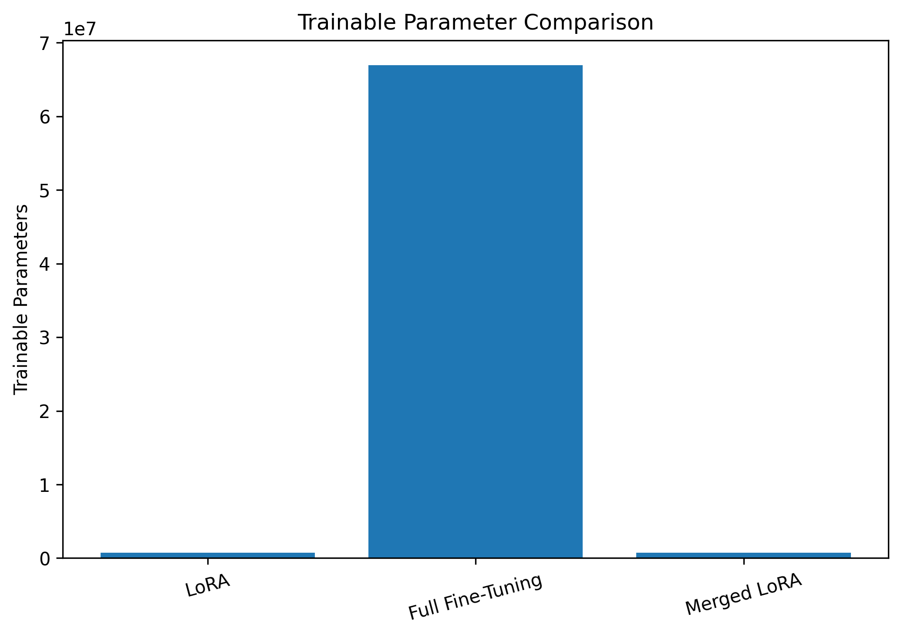
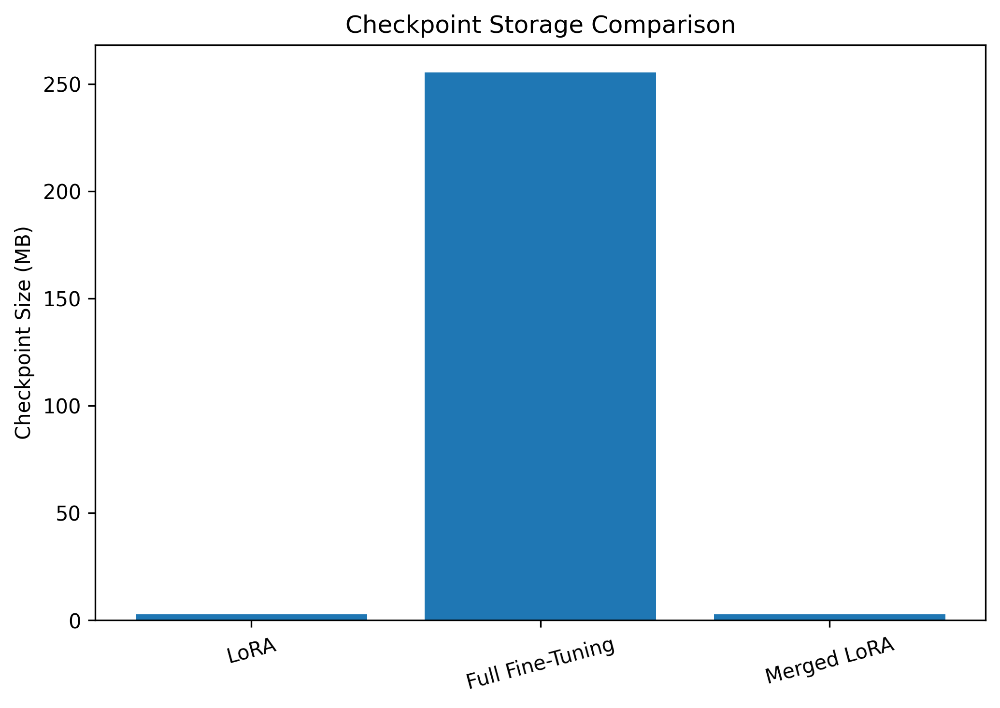
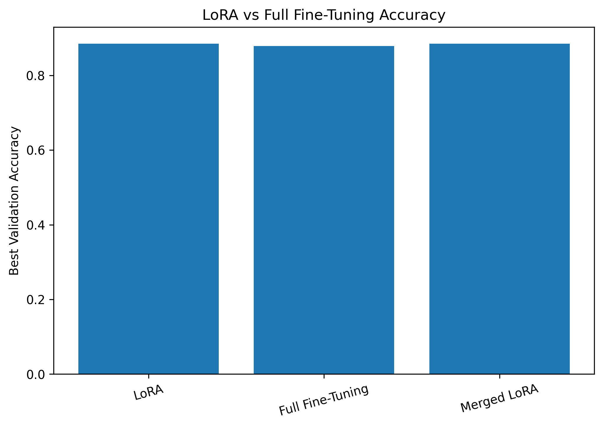
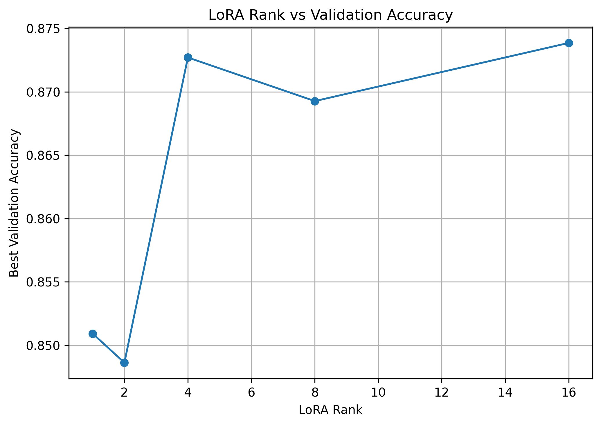
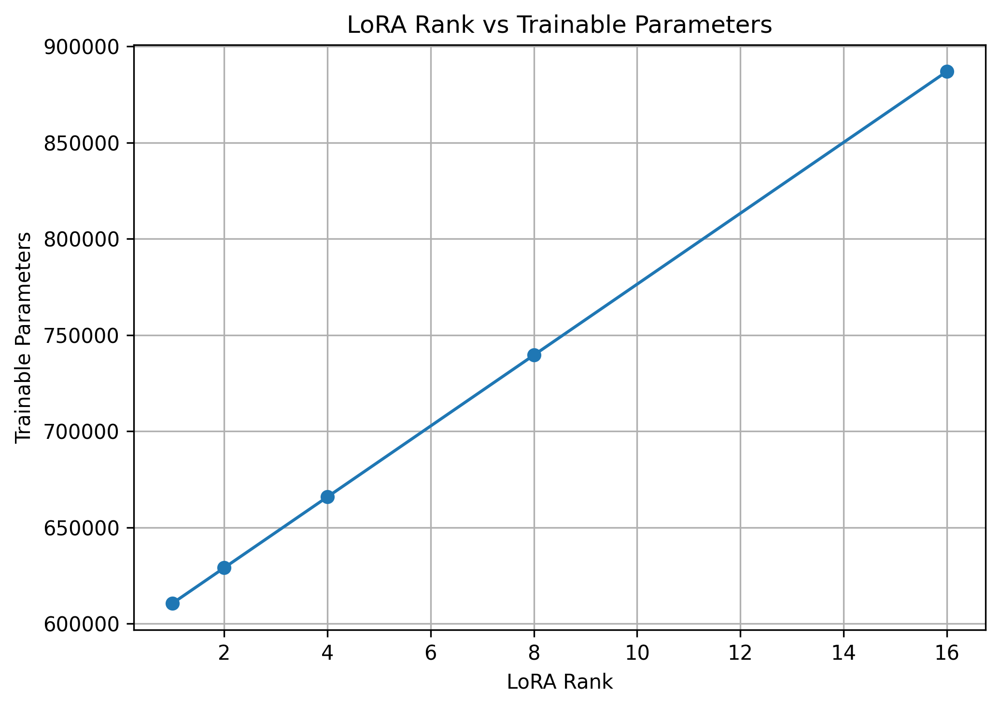
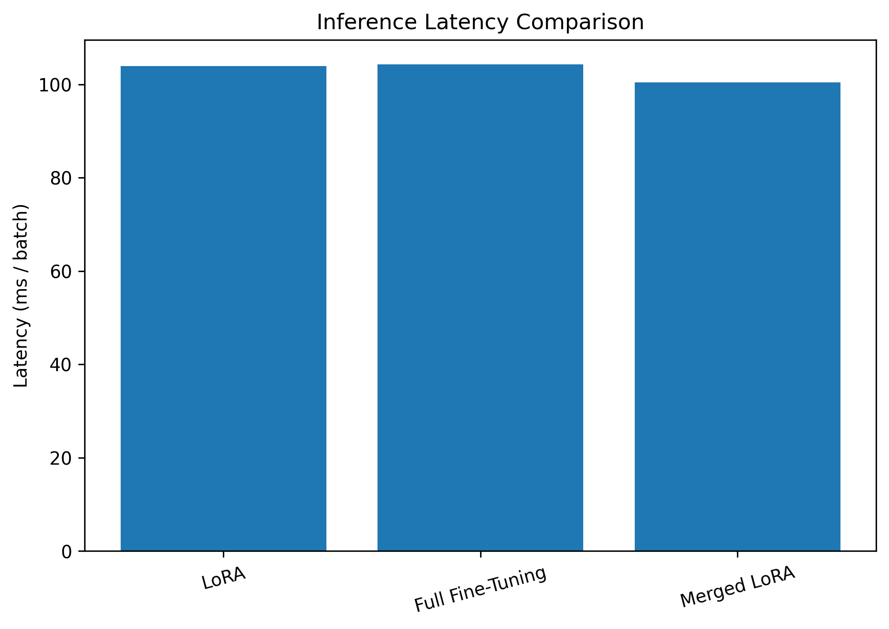

# LoRA From Scratch — Scaled Reproduction & Systems Study

A from-scratch PyTorch implementation of **Low-Rank Adaptation (LoRA)**, inspired by the paper **“LoRA: Low-Rank Adaptation of Large Language Models”** by Hu et al.

This project goes beyond applying an existing PEFT library: it implements the core LoRA mechanism manually, injects it into DistilBERT attention layers, fine-tunes on SST-2, compares it against full fine-tuning, studies rank sensitivity, saves adapter-only checkpoints, merges adapters for deployment, and benchmarks inference latency.

> This is a **scaled reproduction and engineering study**, not a claim of reproducing the full experiments from the original paper.

---

## Highlights

- Implemented `LoRALinear` from scratch in PyTorch
- Froze pretrained weights and trained low-rank matrices `A` and `B`
- Injected LoRA into DistilBERT query and value projections
- Fine-tuned on GLUE SST-2
- Compared LoRA against full fine-tuning
- Ran rank ablations for `r = 1, 2, 4, 8, 16`
- Saved adapter-only checkpoints
- Reduced checkpoint storage by **98.89%**
- Implemented LoRA weight merging for deployment
- Verified merged/unmerged numerical equivalence
- Benchmarked inference latency
- Added reusable source modules and automated unit tests
- **7/7 unit tests passing**

---
## Core Idea

For a pretrained weight matrix:

$$
W_0 \in \mathbb{R}^{d \times k}
$$

LoRA freezes $W_0$ and represents the trainable update using two low-rank matrices:

$$
\Delta W = BA
$$

where:

$$
A \in \mathbb{R}^{r \times k}
$$

and:

$$
B \in \mathbb{R}^{d \times r}
$$

with:

$$
r \ll \min(d,k)
$$

The forward pass becomes:

$$
h = W_0x + \frac{\alpha}{r}BAx
$$

Only the low-rank matrices are optimized while the original pretrained weight remains frozen.


---

## From-Scratch Implementation

The central implementation is `src/lora.py`.

```python
base_output = self.linear(x)

lora_output = (
    (x @ self.lora_A.T)
    @ self.lora_B.T
)

output = (
    base_output
    + self.scaling * lora_output
)
```

The base `nn.Linear` parameters are frozen:

```python
for parameter in self.linear.parameters():
    parameter.requires_grad = False
```

while:

```text
lora_A → trainable
lora_B → trainable
```

`B` is initialized to zero, so the LoRA branch initially contributes no update and the layer starts from the pretrained model's behavior.

In this implementation, `A` uses Kaiming-uniform initialization as a practical implementation choice. The original LoRA paper describes randomly initializing `A` and initializing `B` to zero.

---

## Experimental Setup

| Component | Configuration |
|---|---|
| Base model | DistilBERT (`distilbert-base-uncased`) |
| Task | Binary sentiment classification |
| Dataset | GLUE SST-2 |
| Training subset | 8,000 examples |
| Validation set | 872 examples |
| Sequence length | 128 |
| Batch size | 32 |
| LoRA targets | Query (`q_lin`) and Value (`v_lin`) projections |
| Main LoRA rank | 8 |
| Main LoRA alpha | 16 |
| LoRA learning rate | 2e-4 |
| Full fine-tuning learning rate | 2e-5 |
| Main training epochs | 3 |
| Rank ablation | 1, 2, 4, 8, 16 |
| Rank-ablation epochs | 2 |
| Rank-ablation scaling | alpha = 2 × rank |

The original paper evaluates LoRA across substantially larger pretrained models and multiple NLP settings. This repository intentionally uses a smaller single-GPU experiment to study the mechanism and its engineering properties.

---

## Main Results

| Method | Trainable Params | Trainable % | Best Val Accuracy | Training Time | Checkpoint | Inference |
|---|---:|---:|---:|---:|---:|---:|
| LoRA | 739,586 | 1.10% | **88.53%** | 180.78 s | **2.83 MB** | 103.92 ms/batch |
| Full Fine-Tuning | 66,955,010 | 100% | 87.84% | 249.24 s | 255.45 MB | 104.32 ms/batch |
| Merged LoRA | 739,586* | 1.10%* | **88.53%** | 180.78 s* | 2.83 MB* | **100.45 ms/batch** |

\*For the merged row, training parameters, training time, and adapter checkpoint size describe the LoRA training artifact before merging. Merging is an inference/deployment transformation rather than a separate training run.

### Observed in this scaled experiment

LoRA reached **88.53% validation accuracy**, compared with **87.84%** for the full fine-tuning baseline.

The LoRA training configuration used only **1.10% trainable parameters**, and the adapter checkpoint was only **2.83 MB**, compared with **255.45 MB** for the saved full-model state.

These are results from this specific scaled SST-2 experiment and should not be interpreted as a general claim that LoRA always outperforms full fine-tuning.

---

## Parameter Efficiency

The experiment produced a reported parameter reduction of:

**99.78%**

for the LoRA adaptation compared with updating the full model.



This illustrates the primary motivation behind LoRA: adapting a pretrained model without optimizing every parameter.

---

## Checkpoint Storage

Adapter-only checkpoint:

**2.83 MB**

Full fine-tuned model checkpoint:

**255.45 MB**

Observed storage reduction:

**98.89%**



The adapter checkpoint stores the learned LoRA matrices together with the task-specific classification head rather than duplicating the complete pretrained model.

---

## Validation Accuracy



In this experiment:

```text
LoRA              88.53%
Full Fine-Tuning  87.84%
```

The difference is modest, but LoRA reached this result while training a much smaller fraction of the model parameters.

---

## Rank Ablation

To study the effect of low-rank dimensionality, separate 2-epoch experiments were run with:

```text
r = 1, 2, 4, 8, 16
```

while maintaining:

```text
alpha / r = 2
```

| Rank | Alpha | Trainable Params | Trainable % | Best Val Accuracy | Time |
|---:|---:|---:|---:|---:|---:|
| 1 | 2 | 610,562 | 0.91% | 85.09% | 115.80 s |
| 2 | 4 | 628,994 | 0.94% | 84.86% | 117.17 s |
| 4 | 8 | 665,858 | 0.99% | 87.27% | 117.41 s |
| 8 | 16 | 739,586 | 1.10% | 86.93% | 116.95 s |
| 16 | 32 | 887,042 | 1.32% | **87.39%** | 116.90 s |

Among these 2-epoch ablation runs, **rank 16 achieved the highest validation accuracy**.



Increasing rank also increases the number of trainable parameters:



The experiment demonstrates that rank is a capacity/efficiency trade-off rather than simply a parameter that should always be maximized.

---
## LoRA Weight Merging

During LoRA training:

```math
W = W_0 + \frac{\alpha}{r}BA
```

For deployment, the update can be merged directly into the original weight:

```math
W_{\mathrm{merged}} = W_0 + \frac{\alpha}{r}BA
```

The repository implements this transformation in `src/merge.py`.

After merging, the separate LoRA computation is no longer required during the forward pass.

The automated tests verify that the merged layer produces numerically equivalent outputs to the unmerged LoRA layer within floating-point tolerance.

---

## Inference Benchmark

## Inference Benchmark

Measured batch latency:

```text
Unmerged LoRA : 103.92 ms/batch
Merged LoRA   : 100.45 ms/batch
Full FT       : 104.32 ms/batch
```



The merged model was slightly faster in this benchmark because the separate low-rank branch was removed from the forward path.

These latency measurements are hardware- and workload-dependent and should be interpreted as measurements from this experiment rather than universal performance guarantees.

---

## Adapter-Only Checkpoints

Instead of storing the complete pretrained model, the project extracts:

```text
lora_A
lora_B
pre_classifier
classifier
```

and saves only these task-specific parameters.

Implemented in:

```text
src/checkpoint.py
```

The test suite verifies an adapter save/load round trip by checking that the reconstructed model produces equivalent predictions.

---

## Project Structure

```text
lora-project/
│
├── experiments/
│   ├── experiment_summary.csv
│   ├── lora_vs_full_finetuning.csv
│   └── rank_ablation_results.csv
│
├── notebooks/
│   └── 01_lora_from_scratch.ipynb
│
├── results/
│   └── figures/
│       ├── accuracy_comparison.png
│       ├── checkpoint_size_comparison.png
│       ├── inference_latency_comparison.png
│       ├── parameter_comparison.png
│       ├── rank_vs_accuracy.png
│       └── rank_vs_parameters.png
│
├── src/
│   ├── __init__.py
│   ├── benchmark.py
│   ├── checkpoint.py
│   ├── injection.py
│   ├── lora.py
│   ├── merge.py
│   └── train.py
│
├── tests/
│   └── test_lora.py
│
├── example.py
├── requirements.txt
├── .gitignore
└── README.md
```

---

## Source Modules

### `src/lora.py`

Core from-scratch `LoRALinear` implementation.

### `src/injection.py`

Converts standard linear projections into LoRA layers and injects them into DistilBERT query/value attention projections.

### `src/merge.py`

Computes the low-rank weight update and merges it into the frozen base weights.

### `src/checkpoint.py`

Extracts, saves, and reloads adapter-only checkpoints.

### `src/train.py`

Reusable training, evaluation, accuracy, and parameter-counting utilities.

### `src/benchmark.py`

Inference latency, prediction, and prediction-agreement utilities.

---

## Tests

The repository includes automated tests for:

1. LoRA output shapes
2. Frozen base parameters
3. Zero-initialized LoRA equivalence
4. Single-layer merge equivalence
5. DistilBERT LoRA injection
6. Full DistilBERT merge equivalence
7. Adapter checkpoint save/load round trip

Run:

```bash
python -m pytest -v
```

Current result:

```text
7 passed
```

The DistilBERT integration tests use a tiny randomly initialized model configuration, so they do not require downloading the pretrained model.

---

## Quick Start

Clone the repository:

```bash
git clone https://github.com/Lavanya-Jothivel/lora-from-scratch.git
cd lora-from-scratch
```

Install dependencies:

```bash
python -m pip install -r requirements.txt
```

Run the minimal LoRA demonstration:

```bash
python example.py
```

Run tests:

```bash
python -m pytest -v
```

---

## Minimal Example

```python
import torch

from src.lora import LoRALinear
from src.merge import merge_lora_layer

layer = LoRALinear(
    in_features=768,
    out_features=768,
    rank=8,
    alpha=16,
)

x = torch.randn(2, 10, 768)

output = layer(x)

merged_layer = merge_lora_layer(layer)

merged_output = merged_layer(x)

print(
    torch.allclose(
        output,
        merged_output,
        atol=1e-5,
    )
)
```

---

## Paper vs. This Repository

This repository is not a line-by-line copy of an existing implementation.

The original LoRA paper is treated as the conceptual and mathematical specification for the low-rank adaptation mechanism.

This repository independently implements and experimentally studies that mechanism using PyTorch and a scaled DistilBERT/SST-2 setup.

| Original LoRA Work | This Repository |
|---|---|
| LoRA mechanism | Implemented from scratch |
| Frozen pretrained weights | Implemented |
| Low-rank A/B matrices | Implemented |
| Scaling by alpha/r | Implemented |
| B initialized to zero | Implemented |
| Large-model experiments | Replaced with scaled DistilBERT experiment |
| Multiple NLP settings | SST-2 classification |
| Large-scale hardware | Single-GPU experiment |
| Deployment study | Added adapter checkpointing, merging, tests and latency benchmarking |

---

## Limitations

This is a scaled reproduction rather than a full replication of the original paper.

Important limitations include:

- DistilBERT is much smaller than the largest models studied in the original work.
- The main experiment uses one classification dataset.
- Training uses an 8,000-example subset of SST-2.
- Rank-ablation runs use two epochs and should not be directly compared with the three-epoch main LoRA run as if they were identical experiments.
- The main LoRA and full-fine-tuning runs use method-appropriate learning rates.
- Reported latency depends on the hardware and batch configuration used for measurement.
- Experimental results from this repository should not be interpreted as reproducing the paper's published benchmark numbers.

---

## Reproducibility

Raw experiment outputs are committed under:

```text
experiments/
```

Plots are available under:

```text
results/figures/
```

The full experimental workflow is available in:

```text
notebooks/01_lora_from_scratch.ipynb
```

This separates the exploratory/reproduction notebook from reusable implementation code under `src/`.

---

## Reference

**LoRA: Low-Rank Adaptation of Large Language Models**

Edward J. Hu, Yelong Shen, Phillip Wallis, Zeyuan Allen-Zhu, Yuanzhi Li, Shean Wang, Lu Wang, and Weizhu Chen.

arXiv:2106.09685, 2021.

Paper: https://arxiv.org/abs/2106.09685

---

## Acknowledgements

This project was built as an independent educational and research-engineering study of Low-Rank Adaptation. The original LoRA paper provides the mathematical and conceptual basis for the implementation.

No PEFT library is used to implement the core LoRA mechanism in this repository.